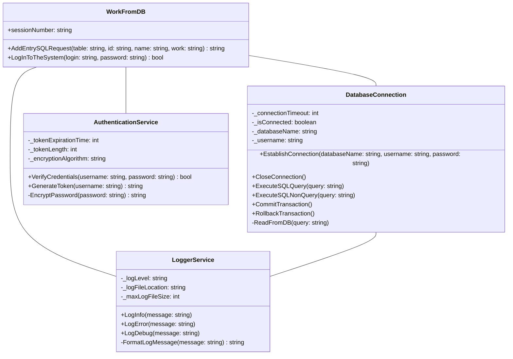

# MsTest
Тестирование модуля для создания запроса на регистрацию пользователя и проверки входа в систему

```mermaid
classDiagram
class WorkFromDB{
    +sessionNumber: string
    +AddEntrySQLRequest(table: string, id: string, name: string, work: string) string
    +LogInToTheSystem(login: string, password: string) bool
}
class DatabaseConnection{
    -_connectionTimeout: int
    -_isConnected: boolean
    -_databaseName: string
    -_username: string
    +EstablishConnection(databaseName: string, username: string, password: string)
    +CloseConnection()
    +ExecuteSQLQuery(query: string)
    +ExecuteSQLNonQuery(query: string)
    +CommitTransaction()
    +RollbackTransaction()
    -ReadFromDB(query: string)
}
class AuthenticationService{
    -_tokenExpirationTime: int
    -_tokenLength: int
    -_encryptionAlgorithm: string
    +VerifyCredentials(username: string, password: string) bool
    +GenerateToken(username: string) string
    -EncryptPassword(password: string) string
}
class LoggerService{
    -_logLevel: string
    -_logFileLocation: string
    -_maxLogFileSize: int
    +LogInfo(message: string)
    +LogError(message: string)
    +LogDebug(message: string)
    -FormatLogMessage(message: string) string
}
WorkFromDB -- DatabaseConnection
WorkFromDB -- AuthenticationService
WorkFromDB -- LoggerService
DatabaseConnection -- LoggerService
```